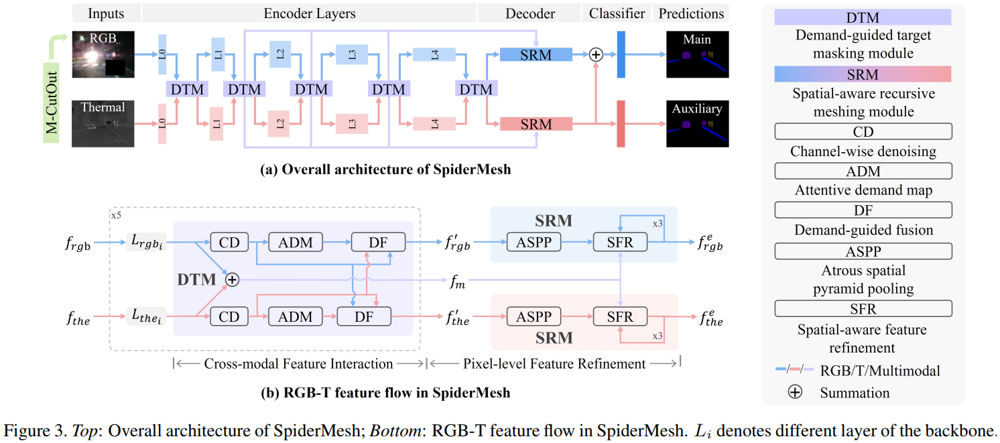
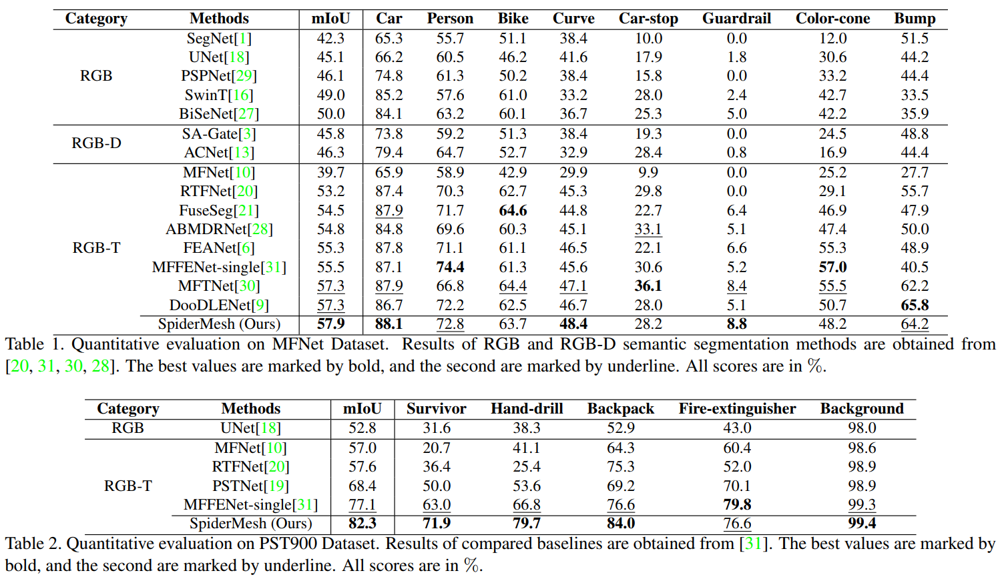
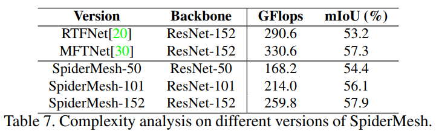

# SpiderMesh: Spatial-aware Demand-guided Recursive Meshing for RGB-T Semantic Segmentation

[](https://paperswithcode.com/sota/thermal-image-segmentation-on-mfn-dataset?p=spidermesh-spatial-aware-demand-guided)
[](https://paperswithcode.com/sota/thermal-image-segmentation-on-pst900?p=spidermesh-spatial-aware-demand-guided)



> For technical details, please refer to:
>
> [SpiderMesh: Spatial-aware Demand-guided Recursive Meshing for RGB-T Semantic Segmentation](https://arxiv.org/abs/2303.08692)

### (0) Abstract

For semantic segmentation in urban scene understanding, RGB cameras alone often fail to capture a clear holistic topology, especially in challenging lighting conditions. Thermal signal is an informative additional channel that can bring to light the contour and fine-grained texture of blurred regions in low-quality RGB image. Aiming at RGB-T (thermal) segmentation, existing methods either use simple passive channel/spatial-wise fusion for cross-modal interaction, or rely on heavy labeling of ambiguous boundaries for fine-grained supervision. We propose a Spatial-aware Demand-guided Recursive Meshing (SpiderMesh) framework that: 1) proactively compensates inadequate contextual semantics in optically-impaired regions via a demand-guided target masking algorithm; 2) refines multimodal semantic features with recursive meshing to improve pixel-level semantic analysis performance. We further introduce an asymmetric data augmentation technique M-CutOut, and enable semi-supervised learning to fully utilize RGB-T labels only sparsely available in practical use. Extensive experiments on MFNet and PST900 datasets demonstrate that SpiderMesh achieves new state-of-the-art performance on standard RGB-T segmentation benchmarks.

### (1) Setup

This code has been tested with Python 3.8.10, Pytorch 1.11.0, CUDA 11.7.

* Setup environment
    ```bash
    conda create -n SpiderMesh python=3.8.10
    source activate SpiderMesh
    ```

* Clone the respository

* Install the requirements
    ```
    pip install -r requirements.txt
    pip install torch torchvision torchaudio --extra-index-url https://download.pytorch.org/whl/cu113
    ```

* Download dataset

    | Dataset     | Note                                  | Link                                                            |
    |-------------|---------------------------------------|-----------------------------------------------------------------|
    | MFNet       | preprocessed by RTFNet*               |[Download](https://pan.baidu.com/s/1mCIAv2qU5TwIfgDFtAR08g):5ah9 |
    | PST900      | original dataset                      |[Download](https://github.com/ShreyasSkandanS/pst900_thermal_rgb)|
  > The original [link](http://nas.ram-lab.com:5000/sharing/CfukComo1) of the preprocessed MFNet (by RTFNet) seems not availuable now, we have upload it to our BaiduCloud.

* Download pretrained models

    | Dataset     | Description                           | Link                                                            |
    |-------------|---------------------------------------|-----------------------------------------------------------------|
    | MFNet       | SpiderMesh-50                               |[Download](https://pan.baidu.com/s/1aEtzRELIJoDemgGRdeD7-w):btkl |
    |             | SpiderMesh-101                              |[Download](https://pan.baidu.com/s/1SM2Y0OXsRPmhiPNDuKXQsA):5t2p |
    |             | SpiderMesh-152                              |[Download](https://pan.baidu.com/s/1jgKGOOatA4BVcOQk0bpXHg):i3me |
    |             | Semi-supervised SpiderMesh-152              |[Download](https://pan.baidu.com/s/1vnJumBsqgVLKjwKoqviMng):8jif |
    | PST900      | SpiderMesh-152                              |[Download](https://pan.baidu.com/s/1dR50K7D0WVJNqmAl8HKWWg):5qzy |


### (2) Training


* Supervised learning
    ```bash
    python train.py # for MFNet dataset
    python train_pst.py # for PST900 dataset
    ```
    

* Semi-supervised learning
    ```bash
    python semi-train.py
    ```
    


### (3) Evaluation
For detailed analysis, three modes are supported: test(default), test_day, test_night.

```bash
python test.py # for MFNet dataset
python test_pst.py # for PST900 dataset
```

* Complexity




## Citation

If you find our work useful in your research, please consider citing:

```
@article{spidermesh,
  title={{SpiderMesh}: Spatial-aware Demand-guided Recursive Meshing for RGB-T Semantic Segmentation},
  author={S. Fan and Z. Wang and Y. Wang and J. Liu},
  journal={arXiv:2303.08692},
  year={2023}}
```


